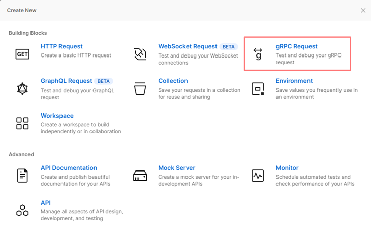
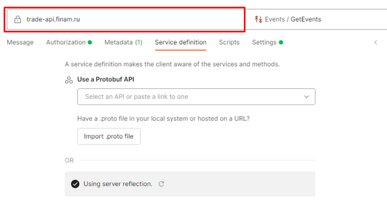
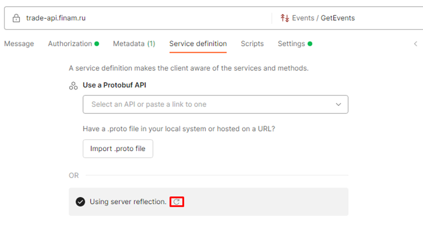
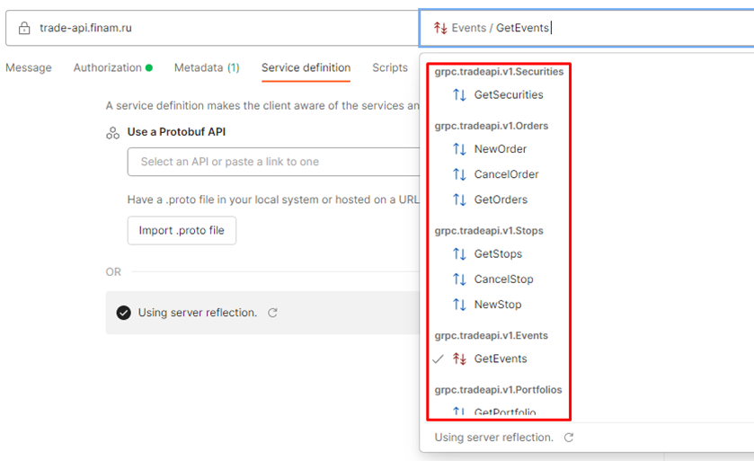
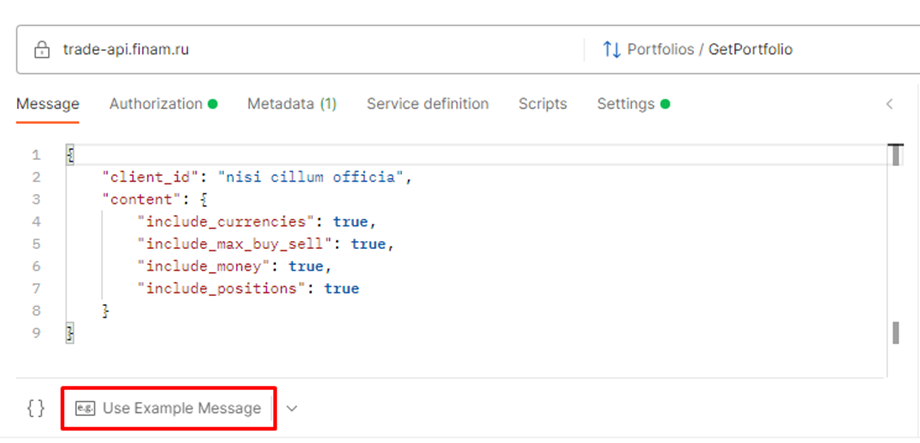
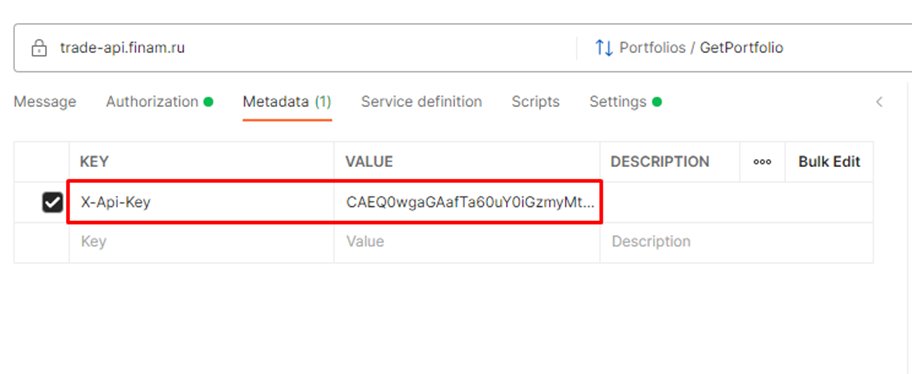
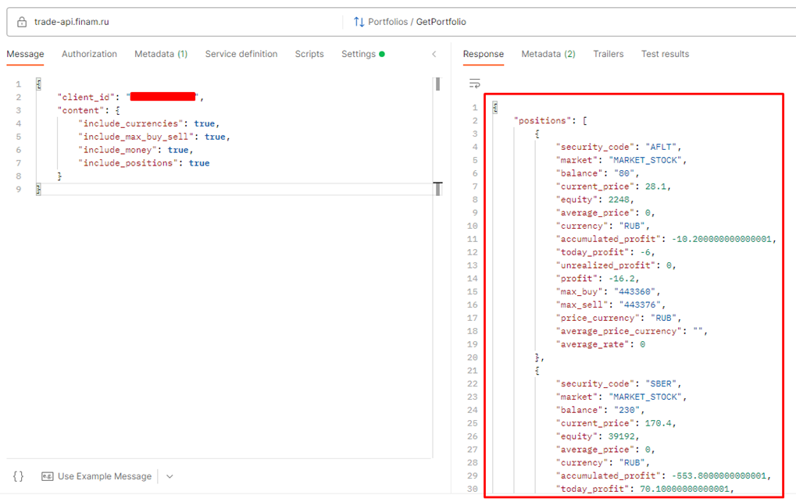

# Рекомендации по тестированию методов Trade API

**Postman** [Скачать](https://www.postman.com/downloads/?utm_source=postman-home)

1. После запуска Postman нажмите `New` и выберите `gRPC Request`
   
2. Укажите адрес сервиса `trade-api.finam.ru` и перейдите на вкладку `Service definition`
   
3. В разделе `Service definition` нажмите на значок обновления для использования `Reflection` со стороны сервера. В
   данном случае загружать самостоятельно proto-файлы не придется.
   
4. В поле `Select a method` отображаются доступные запросы
   
5. После подготовительных действий вы можете приступить к отправке запросов к сервису.

6. Для получения информации по портфелю в списке методов выберите `GetPortfolio` и нажмите `Use example message`
   
7. Отредактируйте «Message», в поле `client_id` необходимо передать trade code (номер счета), с помощью которого был
   сгенерирован токен.

8. Далее, перейти на вкладку `Metadata`, здесь передается информация о токене.
   `X-Api-Key` и сгенерированный токен из сервиса Comon.
   
9. После заполнения `Metadata` и `Message`, отправить запрос, нажав `Invoke`
   

